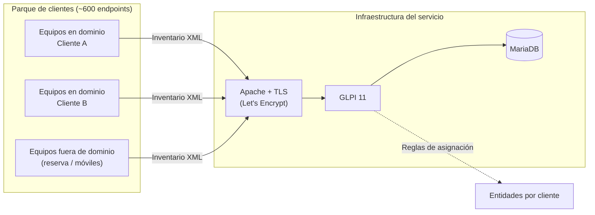

# Inventario de activos multi-tenant con GLPI

Diseño y despliegue de una plataforma de inventario de activos IT para una veintena
de organizaciones cliente y unos 600 endpoints, sustituyendo el mantenimiento manual
en hojas de cálculo.

!!! info "Contexto"
    Proyecto realizado en un proveedor de servicios gestionados (MSP) que da soporte
    a clientes de distintos sectores. Los nombres de cliente, dominios internos y
    direccionamiento se han omitido u ofuscado.

---

## La solución de negocio

Un MSP con una veintena de clientes bajo contrato de mantenimiento necesita responder
a preguntas que parecen triviales y no lo son cuando el dato vive en hojas de cálculo
mantenidas a mano: cuántos equipos tiene realmente cada cliente, cuáles se quedan sin
soporte el año que viene, qué máquina tiene asignada una persona concreta, o qué
equipos llevan meses sin conectarse.

La plataforma resuelve eso con un inventario que se actualiza solo. Cada endpoint
reporta su propio hardware, software y estado, y el dato aterriza en la entidad del
cliente al que pertenece. A partir de ahí:

- **Renovaciones y presupuestos** con datos reales de parque, no estimaciones.
- **Obsolescencia** detectable por antigüedad y por versión de sistema operativo.
- **Trazabilidad de asignación**: quién tiene qué equipo, y en qué estado está.
- **Aislamiento entre clientes**: cada entidad ve su propio parque y nada más.

El alcance se acotó deliberadamente a inventario. El ticketing ya estaba resuelto con
otra herramienta y meter ambas cosas en el mismo sistema habría convertido un proyecto
de tres meses en uno de un año.

---

## Arquitectura



**Servidor.** GLPI 11 sobre una máquina virtual Linux en un hipervisor propio, con
Apache como frontal y MariaDB como backend. Certificado de Let's Encrypt emitido por
desafío DNS-01, porque el servicio no se expone en el puerto 80 y el desafío HTTP-01
no era viable.

**Publicación.** El servicio se publica en un puerto no estándar. Esta decisión, que
parecía menor, resultó ser el punto más conflictivo del proyecto: los clientes cuyo
tráfico sale por un proxy corporativo o por una solución SASE no siempre tienen
permitidos puertos distintos del 443 hacia destinos externos, y el agente falla en
silencio. En despliegues nuevos conviene resolver el NAT al 443 antes de tocar
ningún endpoint.

**Multi-tenancy.** GLPI organiza los datos en entidades. Cada cliente es una entidad,
y los técnicos ven el conjunto mientras que cada contexto de cliente queda separado.
El acceso está limitado al equipo técnico; la integración con LDAP y el SSO se
aplazaron conscientemente por ser tres personas.

---

## Asignación automática a entidades

Es la pieza que hace que el sistema escale: si cada equipo nuevo hubiera que moverlo
a mano a su cliente, el inventario automático no valdría de nada.

**Equipos en dominio.** Las reglas de asignación se basan en la pertenencia al dominio
de Active Directory. El equipo reporta su dominio en el inventario y GLPI lo encamina
a la entidad correspondiente.

**Equipos fuera de dominio.** Para máquinas de reserva o equipos sueltos que no están
unidos a ningún dominio, la identificación se hace por TAG, escrito en el registro de
Windows:

```powershell
Set-ItemProperty -Path 'HKLM:\SOFTWARE\GLPI-Agent' -Name 'tag' -Value 'CLIENTE_X'
Restart-Service 'GLPI-Agent'
```

Un matiz importante que descubrí probando: el TAG identifica el contexto en el XML de
inventario, pero **no asigna la entidad por sí solo**. Hacen falta reglas explícitas en
*Administración > Reglas > Reglas de asignación a una entidad* que lo consuman. Sin
ellas, el TAG viaja hasta el servidor y no hace nada.

---

## Despliegue del agente

Tres vías según el tipo de equipo, todas sobre GLPI Agent 1.18 x64.

=== "GPO"

    Para equipos en dominio. El MSI se publica como aplicación asignada desde
    directiva de grupo, con los parámetros de servidor y TAG pasados en la
    instalación. Es el camino por defecto y cubre la mayor parte del parque.

=== "Intune"

    Para equipos gestionados desde la nube. El MSI se empaqueta como `.intunewin`
    con IntuneWinAppUtil y se despliega como aplicación Win32. La regla de detección
    apunta a `HKLM\SOFTWARE\GLPI-Agent`, valor `server`, en vez de a un archivo o a
    una versión de producto: es más fiable porque comprueba que el agente está
    *configurado*, no solo instalado.

=== "Manual"

    Para equipos sueltos, pruebas o máquinas que no encajan en ninguna de las dos
    anteriores. Un script de PowerShell propio instala el MSI, escribe la
    configuración y fuerza un inventario inmediato para validar el resultado sin
    esperar al ciclo normal del agente.

En el despliegue por Intune, el código de retorno **1618** está configurado como
reintento. Ese código significa que otro instalador tiene tomado el mutex de Windows
Installer, típicamente Windows Update. A escala de cientos de equipos aparece sí o sí,
y si no se trata como reintento se interpreta como fallo de despliegue.

---

## Con qué me peleé

**La configuración no está donde la documentación sugiere.** En GLPI Agent 1.18 sobre
Windows, los valores de servidor y TAG viven en el registro
(`HKLM:\SOFTWARE\GLPI-Agent`), no en `agent.cfg`. Editar el fichero no produce ningún
efecto. Cualquier corrección pasa por `Set-ItemProperty` y reinicio del servicio.

**Forzar un inventario.** La forma fiable no es invocar el ejecutable del agente, sino
el endpoint HTTP que el propio agente expone en local:

```powershell
Invoke-RestMethod 'http://localhost:62354/now'
```

Esto acortó los ciclos de prueba de horas a segundos.

**Cambiar un TAG no reescribe el pasado.** Si una máquina ya se importó en la entidad
equivocada, corregir el TAG arregla los inventarios futuros pero no reevalúa las reglas
sobre el registro ya existente. Hay que transferir el activo a mano o purgarlo. Lección:
validar las reglas de asignación contra un grupo pequeño antes de soltar el despliegue
masivo.

**El agente pisa lo que escribes a mano.** El inventario sobrescribe campos como el
usuario asignado en cada sincronización. La solución es el bloqueo de campos en GLPI,
que marca ciertos valores como gestionados manualmente y los protege del agente.

**Definir el catálogo de estados antes, no después.** Establecer los estados posibles
(en stock, cedido temporal, en uso, retirado) antes del despliegue masivo evita una
limpieza retroactiva sobre cientos de registros.

**Hairpin NAT.** Verificar la publicación con `curl` desde el propio servidor da
resultados engañosos. La comprobación válida se hace desde una máquina externa o desde
la red del cliente.

**Detalle de PowerShell.** `$args` es una variable automática reservada; usarla como
nombre para los parámetros del MSI provoca comportamientos difíciles de diagnosticar.

---

## Estado y siguientes pasos

La plataforma está en producción con el parque inventariado y las entidades asignadas
automáticamente. La hoja de ruta inmediata, por orden de prioridad:

1. **Copias de seguridad de la base de datos.**
2. **Ajuste de rendimiento**: OPcache al 100% de uso con 128 MB, a subir a 256 MB;
   revisión de `innodb_buffer_pool_size` en MariaDB.
3. **Inyección de datos históricos por número de serie** desde las hojas de cálculo
   originales, mediante el plugin Data Injection.
4. **Cuadros de mando e informes de obsolescencia por entidad.**

Aplazado de forma consciente: descubrimiento de red por SNMP, inventario de
hipervisores, LDAP por entidad, cumplimiento de licencias y despliegue del agente en
macOS a escala.
